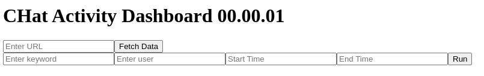
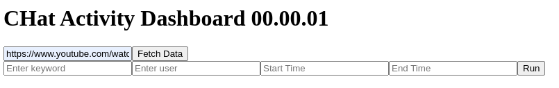

# CHAD

CHAD (CHat Activity Dashboard) is a Python tool designed to visualize chat activity from YouTube and Twitch VODs. It provides detailed plots of overall chat activity and keyword-specific activity using Plotly, Dash, and chat-downloader.

## Features
- Visualize chat activity over the duration of a VOD
- Plot keyword-specific activity to identify key moments
- Interactive UI with zoom and filter capabilities
- Supports both YouTube and Twitch VODs
- Ugly UI (yes it's a feature, not a skill issue... lmao)

## Requirements
- Python 3.x
- Pandas
- Numpy
- Plotly
- Dash
- Chat-Downloader
- Typer
- Beautiful Soup
- ... (see requirements.txt)

## Installation
Clone the repository and install the required packages:

```bash
git clone https://github.com/david-ca6/chad.git
cd chad
pip install -r requirements.txt
```

## Use
### Dashboard Serve
```bash
python src/chad.py serve
```
- open the dashboard in your browser see terminal output for IP and Port (by default http://127.0.0.1:8050/)

- Copy the Stream URL to the URL text box and click "Fetch Data"

- Wait while chat-downloader download the data

- use Keyword to filter the chat

- Zoom on interesting part, the table will be automatically updated
- Click on a green bar to open the VOD at the timestamp


### VodTS Timestamps to Resolve ELD Marker
For more information on LiveTS/VodTS Timestamps files:  [LiveTS extension](https://github.com/CA6-LiveTS/LiveTS-Chrome)
```bash
python src/chad.py vodts2edl [vodts file] [edl file]
```

### Q&A
- Q: Why an analysis tool? Doesn't it remove the human side of clipping?  
A: the graph still needs to be analyzed by a human, it's just a different way to visualize the stream.
There are no auto-clipping features in the tool and no automated detection of spikes since it would be like cheating.
The tool is intended to help you find interesting moments you missed in the VOD.

- Q: Why multi keyword search?  
A: By using related keywords, you can try to detect certain moods in chat, for example, "lol|lmao|lul|kek|kekw" allows you to search for funny moments in the VOD.

- Q: Why the User Filter? It's creepy!  
A: The user filter is intended to be used for bots messages (like raid or change of game on Twitch) or Translator that don't use tags in their message.

### Note

#### Thanks
Special Thanks to [Animal Friend](https://www.youtube.com/@animalfriendpartii) for providing the original Chat Analyser concept to the clipping mine.
