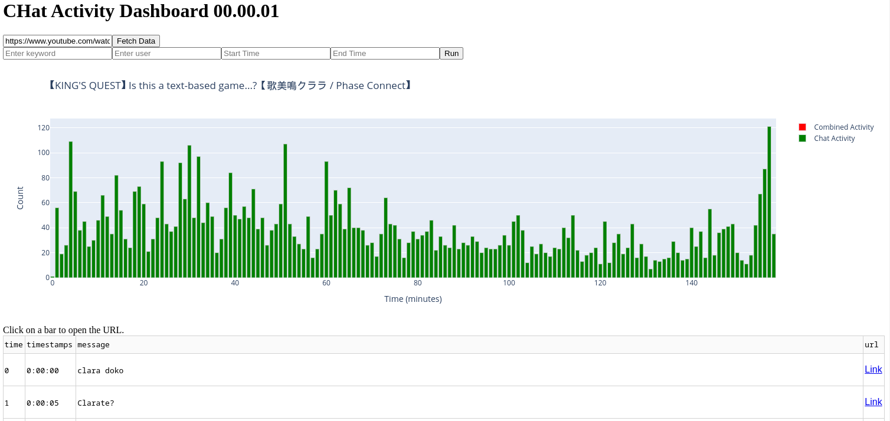
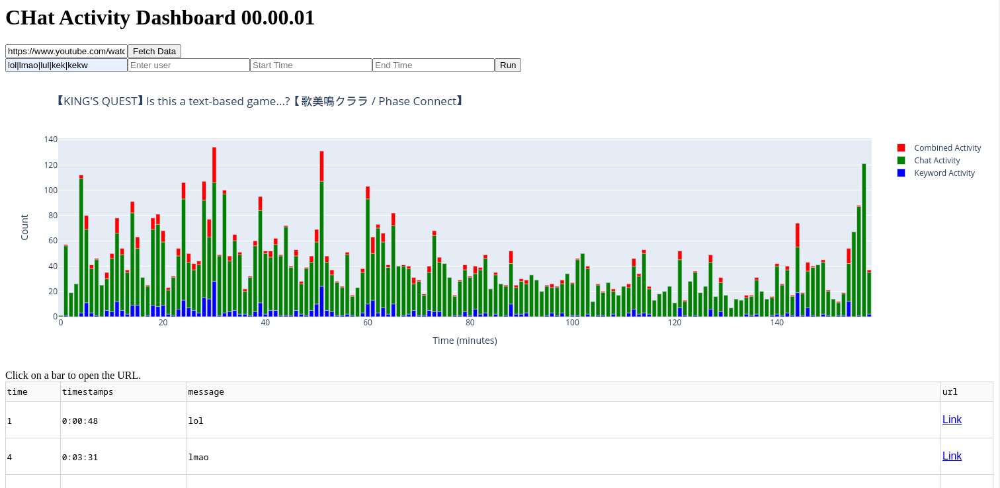

# CHAD

CHAD (Chat Activity Dashboard) is a Python tool designed to visualize chat activity from YouTube and Twitch VODs. It provides detailed plots of overall chat activity and keyword-specific activity using Plotly, Dash, and chat-downloader.

## Features
- Visualize chat activity over the duration of a VOD
- Plot keyword-specific activity to identify key moments
- Interactive UI with zoom and filter capabilities
- Supports both YouTube and Twitch VODs
- Ugly UI (yes it's a feature, not a skill issue... lmao)

## Requirements
- Python 3.x
- Pandas
- Numpy
- Plotly
- Dash
- Chat-Downloader
- Typer
- Beautiful Soup
- ... (see requirements.txt)

## Installation
Clone the repository and install the required packages:

```bash
git clone https://github.com/david-ca6/chad.git
cd chad
pip install -r requirements.txt
```

## Use
### Dashboard Serve
```bash
python src/chad.py serve
```
- open the dashboard in your browser see terminal output for IP and Port (by default http://127.0.0.1:8050/)
- Copy the Stream URL to the URL text box
- click "Fetch Data" and wait while chat-downloader download the data

- use Keyword to filter the chat

- Zoom on interesting part, the table will be automatically updated
- Click on a green bar to open the VOD at the timestamp


### VodTS Timestamps to Resolve ELD Marker
For more information on LiveTS/VodTS Timestamps files:  [LiveTS extension](https://github.com/CA6-LiveTS/LiveTS-Chrome)
```bash
python src/chad.py vodts2edl [vodts file] [edl file]
```
